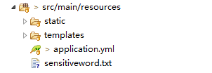

# plugin
## 1.公共组件
plugin-common

该工程主要是搭建web工程需要的一些基本工具和模型，当然这些工具和模型只是在我的体系里有用，其它的体系可能不兼容。

### 1.1.验证码使用

```java
//jpg
response.setHeader("Pragma", "No-cache");
response.setHeader("Cache-Control", "no-cache");
response.setDateHeader("Expires", 0);
response.setContentType("image/jpg");
/**
 * jgp格式验证码 宽，高，位数。
 */
BaseCaptcha captcha = new SpecCaptcha(146, 33, 4);
// 输出
captcha.out(response.getOutputStream());
HttpSession session = request.getSession(true);
session.setAttribute(CommonConstant.LOGIN_VALIDATECODE_KEY, captcha.text().toLowerCase());
```

```java
//gif
response.setHeader("Pragma", "No-cache");
response.setHeader("Cache-Control", "no-cache");
response.setDateHeader("Expires", 0);
response.setContentType("image/gif");
/**
 * gif格式动画验证码 宽，高，位数。
 */
BaseCaptcha captcha = new GifCaptcha(146, 33, 4);
// 输出
captcha.out(response.getOutputStream());
HttpSession session = request.getSession(true);
session.setAttribute(CommonConstant.LOGIN_VALIDATECODE_KEY, captcha.text().toLowerCase());
```

## 2.反重复提交插件
plugin-anti-duplicate-commit

该工程依赖了plugin-common，这个工程主要是为了防止重复提交。

配置反重复提交插件

```yml
plugin:
  anti-duplicate-commit: 
    message: 页面超时请刷新重试!
```

开启反重复提交插件

```java
/**
 * 项目启动类
 * @author sly
 * @time 2019年5月16日
 */
@SpringBootApplication
@EnableAntiDuplicateCommit
public class Application {

	public static void main(String[] args) {
		SpringApplication.run(Application.class, args);
	}

}
```

使用反重复提交插件：@AntiDuplicateCommit(keys = { DemoToken.DEMO_ADD_TOKEN }, isCheckToken = false, isReturnToken = true)
> keys：token的key,可以是多个。  
> isCheckToken：是否验证token，默认true。  
> isReturnToken：是否向页面或返回对象中返回新的token，默认true。  

```java
@RequestMapping("/toAdd")
@AntiDuplicateCommit(keys = { DemoToken.DEMO_ADD_TOKEN }, isCheckToken = false, isReturnToken = true)
public String toAdd(HttpServletRequest request, HttpServletResponse response) {
	return "/pages/add.html";
}

@ResponseBody
@RequestMapping("/demoAddSubmit")
@AntiDuplicateCommit(keys = { DemoToken.DEMO_ADD_TOKEN }, isCheckToken = true, isReturnToken = false)
public Object demoAddSubmit(HttpServletRequest request, HttpServletResponse response) {
	Map<String, Object> result = new HashMap<>(16);
	try {
		System.out.println("我是新增业务方法,我执行了!");
		result.put("status", 200);
		result.put("message", "新增成功!");
	} catch (Exception e) {
		LOGGER.error(ExceptionUtils.getStackTrace(e));
		result.put("status", 400);
		result.put("message", "新增失败!");
	}
	return result;
}
```


## 3.xss过滤器
plugin-xss-filter

该工程是为了防止xss攻击，对请求数据做了过滤。

配置xss过滤器：

```yml
plugin:
  xss-filter:
    exclude:
      exclude-path: /demo/demoUpdateSubmit	
```

开启xss过滤器@EnableXssFilter

```java
/**
 * 项目启动类
 * @author sly
 * @time 2019年5月16日
 */
@SpringBootApplication
@EnableXssFilter
public class Application {

	public static void main(String[] args) {
		SpringApplication.run(Application.class, args);
	}

}
```

默认过滤字符配置如下,如果需要修改自行在配置文件中配置：

```java
/** 需要过滤的字符 */
private String[] sqlstr = { "'", "exec", "execute", "insert", "delete", "update", "drop", "\\%", "master",
		"truncate", "declare", "sitename", "xp_cmdshell", "create", "table", "grant", "group_concat", "column",
		"schema", "union", ";--", "<", ">", "\\(", "\\)", "eval\\((.*)\\)" };

/** 过滤后的字符 */
private String[] nsqlstr = { "＇", "ｅｘｅｃ", "ｅｘｅｃｕｔｅ", "ｉｎｓｅｒｔ", "ｄｅｌｅｔｅ", "ｕｐｄａｔｅ", "ｄｒｏｐ", "％", "ｍａｓｔｅｒ",
		"ｔｒｕｎｃａｔｅ", "ｄｅｃｌａｒｅ", "ｓｉｔｅｎａｍｅ", "ｘｐ＿ｃｍｄｓｈｅｌｌ", "ｃｒｅａｔｅ", "ｔａｂｌｅ", "ｇｒａｎｔ", "ｇｒｏｕｐ＿ｃｏｎｃａｔ", "ｃｏｌｕｍｎ",
		"ｓｃｈｅｍａ", "ｕｎｉｏｎ", "；－－", "＜", "＞", "（", "）", "ｅｖａｌ＼＼（（．＊）＼＼）" };
```


## 4.参数验证插件
plugin-validate

该工程是为了简化对请求参数的验证，该工程依赖了plugin-common。

开启参数验证@EnableValidate

```java
/**
 * 项目启动类
 * @author sly
 * @time 2019年5月16日
 */
@SpringBootApplication
@EnableValidate
public class Application {

	public static void main(String[] args) {
		SpringApplication.run(Application.class, args);
	}

}
```

```java
import java.io.Serializable;

import com.sly.plugin.validate.constraints.Email;
import com.sly.plugin.validate.constraints.NotBlank;
import com.sly.plugin.validate.constraints.NumRange;
import com.sly.plugin.validate.constraints.Phone;

/**
 * 
 * @author sly
 * @time 2019年6月26日
 */
public class Business implements Serializable {

	private static final long serialVersionUID = -2948516389745592347L;

	@NotBlank(message = "Id不能为空", group = { "update" })
	private String Id;

	@NumRange(min = 0, max = 999, message = "Count范围为[0-999]", group = { "update", "add" })
	private Integer count;

	@Phone(message = "手机号格式不正确!", group = { "update", "add" })
	private String phone;

	@NotBlank(message = "邮箱不能为空!", group = { "update", "add" })
	@Email(message = "邮箱格式不正确!", group = { "update", "add" })
	private String email;

	public String getId() {
		return Id;
	}

	public void setId(String id) {
		Id = id;
	}

	public Integer getCount() {
		return count;
	}

	public void setCount(Integer count) {
		this.count = count;
	}

	public String getPhone() {
		return phone;
	}

	public void setPhone(String phone) {
		this.phone = phone;
	}

	public String getEmail() {
		return email;
	}

	public void setEmail(String email) {
		this.email = email;
	}

}
```

在需要验证参数的方法上加上@Validate注解，为需要验证的参数加上对应的验证注解，对象参数包含多个字段使用@Valid("add")注解，该注解参数是分组。如果是单个字段可以使用相关注解验证。

新增分组：

```java
@Validate
@ResponseBody
@RequestMapping("/demoAddSubmit")
@AntiDuplicateCommit(keys = { DemoToken.DEMO_ADD_TOKEN }, isReturnToken = false)
public Object demoAddSubmit(HttpServletRequest request, HttpServletResponse response,@Valid("add") Business business) {
	System.out.println(JSON.toJSONString(business));
	Map<String, Object> result = new HashMap<>(16);
	try {
		System.out.println("我是新增业务方法,我执行了!");
		result.put("status", 200);
		result.put("message", "新增成功!");
	} catch (Exception e) {
		LOGGER.error(ExceptionUtils.getStackTrace(e));
		result.put("status", 400);
		result.put("message", "新增失败!");
	}
	return result;
}
```

修改分组：

```java
@Validate
@ResponseBody
@RequestMapping("/demoUpdateSubmit")
@AntiDuplicateCommit(keys = { DemoToken.DEMO_UPDATE_TOKEN }, isReturnToken = false)
public Object demoUpdateSubmit(HttpServletRequest request, HttpServletResponse response,
		@Valid("update") Business business) {
	Map<String, Object> result = new HashMap<>(16);
	try {
		System.out.println("我是修改业务方法,我执行了!");
		result.put("status", 200);
		result.put("message", "修改成功!");
	} catch (Exception e) {
		LOGGER.error(ExceptionUtils.getStackTrace(e));
		result.put("status", 400);
		result.put("message", "修改失败!");
	}
	return result;
}
```

单个字段验证（单个字段可以添加多个验证注解（@NotBlank(message="Id不能为空!") @Null(message="Id必须为空!") String id））。

```java
@Validate
@ResponseBody
@RequestMapping("/demoDeleteSubmit")
@AntiDuplicateCommit(keys = { DemoToken.DEMO_DELETE_TOKEN })
public Object demoDeleteSubmit(HttpServletRequest request, HttpServletResponse response,@NotBlank(message="Id不能为空!") String id) {
	Map<String, Object> result = new HashMap<>(16);
	try {
		System.out.println("我是删除业务方法,我执行了!");
		result.put("status", 200);
		result.put("message", "删除成功!");
	} catch (Exception e) {
		LOGGER.error(ExceptionUtils.getStackTrace(e));
		result.put("status", 400);
		result.put("message", "删除失败!");
	}
	return result;
}
```

## 5.敏感词验证插件

验证敏感词

1.文件配置敏感词词库方式。  
  


配置文件位置。

```yml
plugin:
  sensitive-word:
    word-file-location: sensitiveword.txt
    inva-char: '@#'
```

启动类使用注解@EnableSensitiveWord。

```java
@SpringBootApplication
@EnableSensitiveWord
public class Application {

	public static void main(String[] args) {
		SpringApplication.run(Application.class, args);
	}

}
```

注入对象进行验证。

```java
@Autowired
private SensitivewordFilter sensitivewordFilter;

@ResponseBody
@RequestMapping("/sensitiveWord")
public Object demoSensitiveWord(HttpServletRequest request, HttpServletResponse response,String word) {
	Map<String, Object> result = new HashMap<>(16);
	try {
		Set<String> sensitiveWord = sensitivewordFilter.getSensitiveWord(word, SensitivewordFilter.maxMatchType);
		result.put("status", 200);
		result.put("message", "敏感词验证成功!");
		result.put("sensitiveWord", sensitiveWord);
	} catch (Exception e) {
		LOGGER.error(ExceptionUtils.getStackTrace(e));
		result.put("status", 400);
		result.put("message", "敏感词验证失败!");
	}
	return result;
}
```

测试结果：  


2.其它方式配置敏感词词库  
保持上面的操作不变，不需要配置敏感词文件位置了，需要自己写监听器在项目启动后设置敏感词。因为这种方式词库的来源可能是数据库之类的地方，必须项目启动后查询才有值。也可以利用下面的方法重置词库。

List<String> keyWordList

```java
sensitivewordFilter.sensitiveWordMap = sensitiveWordInit.initKeyWord(keyWordList);
sensitivewordFilter.sensitiveWordset = sensitiveWordInit.sensitiveWordset;
```

配置文件说明
wordFileLocation：敏感词文件位置  
invaChar ：无效字符 默认:空格、*、#、@ 。
